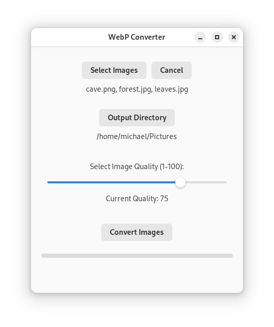

## WebP Converter
An easy and quick tool with a simple Linux GUI to convert images of various format to .webp. This tool was designed for web developers to have a fast an easy way to convert images locally for faster web loading of images. It is available on [Flathub](https://flathub.org/apps/io.itsterminal.WebPConverter) as a Flatpak.

## Features
- Convert as many images as you like at once
- Set the qaulity level of the compression with an easy slider
- Easily select your output directory

<p align="center">
    
</p>

## Non-Flatpak Use (python only)
If you dont want to install the Flatpak from [Flathub](https://flathub.org/apps/io.itsterminal.WebPConverter) you can simply only download the webp_converter.py file and run it using python only.

```python
python3 webp_converter.py
```

## Building From Source (As a Flatpak)
To build this app from source, you'll need the following:

- [Flatpak](https://flatpak.org/setup/) installed on your system
- [Flatpak Builder](https://docs.flatpak.org/en/latest/flatpak-builder.html) installed
- A compatible build environment (Linux running Gnome Desktop)

## Build Process

To build and install the app locally from source, follow these steps:

1. **Clone the repository**:
   ```bash
   git clone https://github.com/yourusername/WebPConverter.git && cd WebPConverter
   ```
2. **Install the required Flatpak runtime and SDK:**
    ```bash
    flatpak install flathub org.freedesktop.Platform//22.08
    flatpak install flathub org.freedesktop.Sdk//22.08
    ```
3. **Build the flatpak app:**
    ```bash
    flatpak-builder --user --install --force-clean build-dir com.example.WebPConverter.json
    ```
    - This will create a build-dir directory for the build process
    - Build and install the app for the current user. If you want it installed system wide remove the ```--user``` flag.
    - ```--force-clean``` can be used if you are having trouble and need to build multiple times.
4. **Run the app:**
    ```bash
    flatpak run com.example.WebPConverter
    ```
    Additionally a new app icon should appear in your applications menu.
